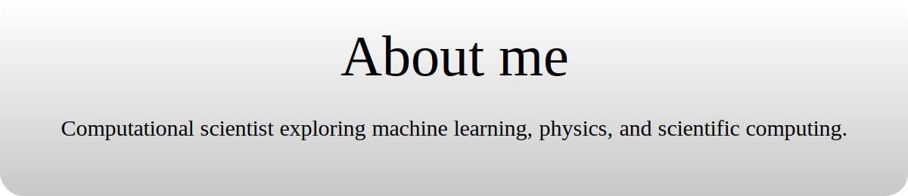

## Work & projects

- Working at the intersection of **physics** and **machine learning**
- Developing **Physics-Informed Neural Networks (PINNs)** for scientific problem-solving
- Exploring **quantum many-body systems** and emergent phenomena
- Researching **neural representations** of physical systems
- Scaling up **large-scale ML applications** for scientific computing

_Last updated: 2026-03-11_
